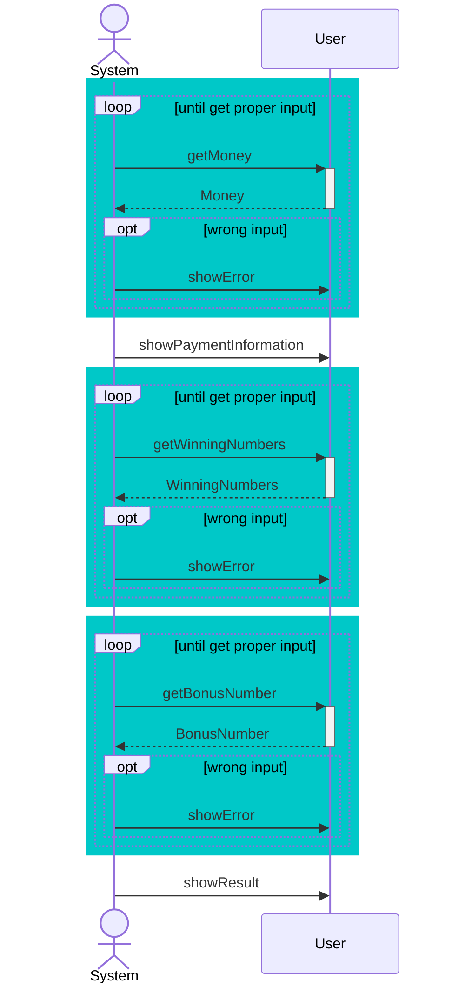
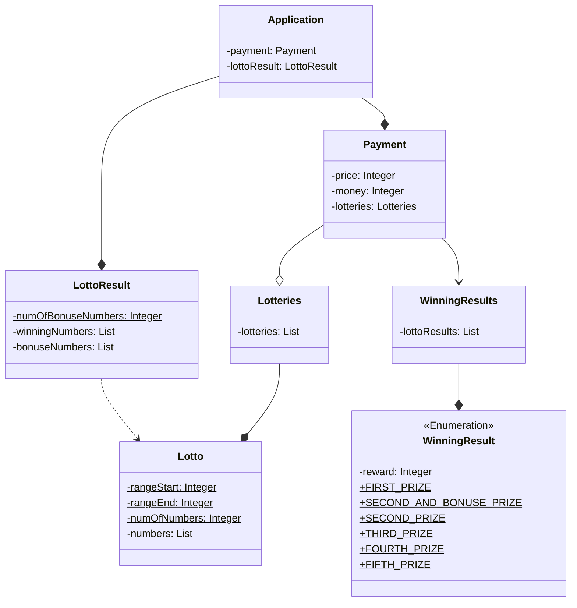

## OOA

### System Sequence

```mermaid
sequenceDiagram
    actor System
    participant User
    
    rect rgb(0, 200, 200)
        loop until get proper input
            System->>+User: getMoney
            User-->>-System: Money
            
            opt wrong input
                System->>User: showError
            end
        end
    end
    
    System->>User: showPaymentInformation
    
    rect rgb(0, 200, 200)
        loop until get proper input
            System->>+User: getWinningNumbers
            User-->>-System: WinningNumbers
            
            opt wrong input
                System->>User: showError
            end
        end
    end
    
    rect rgb(0, 200, 200)
        loop until get proper input
            System->>+User: getBonusNumber
            User-->>-System: BonusNumber
            
            opt wrong input
                System->>User: showError
            end
        end
    end
    
    System->>User: showResult
```

### Domain Model

```mermaid
classDiagram
    Application --* Payment
    Application --* LottoResult
    
    Payment --o Lotteries
    Payment --> WinningResults
    
    LottoResult ..> Lotto
    
    Lotteries --* Lotto
    WinningResults --* WinningResult
    
    class Application {
        -payment: Payment
        -lottoResult: LottoResult
    }
    
    class Payment {
        -price: Integer$
        -money: Integer
        -lotteries: Lotteries
    }
    
    class Lotto {
        -rangeStart: Integer$
        -rangeEnd: Integer$
        -numOfNumbers: Integer$
        -numbers: List<Integer>
    }
    
    class Lotteries {
        -lotteries: List<Lotto>
    }
    
    class LottoResult {
        -numOfBonuseNumbers: Integer$
        -winningNumbers: List<Integer>
        -bonuseNumbers: List<Integer>
    }
    
    class WinningResult {
        <<Enumeration>>
        -reward: Integer
        +FIRST_PRIZE$
        +SECOND_AND_BONUSE_PRIZE$
        +SECOND_PRIZE$
        +THIRD_PRIZE$
        +FOURTH_PRIZE$
        +FIFTH_PRIZE$
    }
    
    class WinningResults {
        -lottoResults: List<WinningResult>
    }
```
