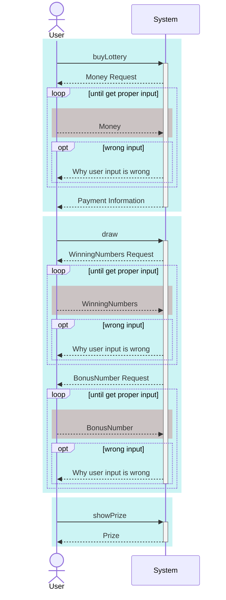
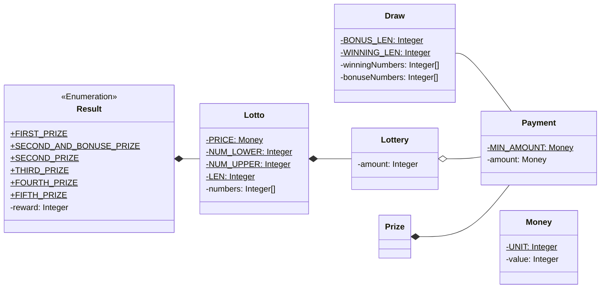
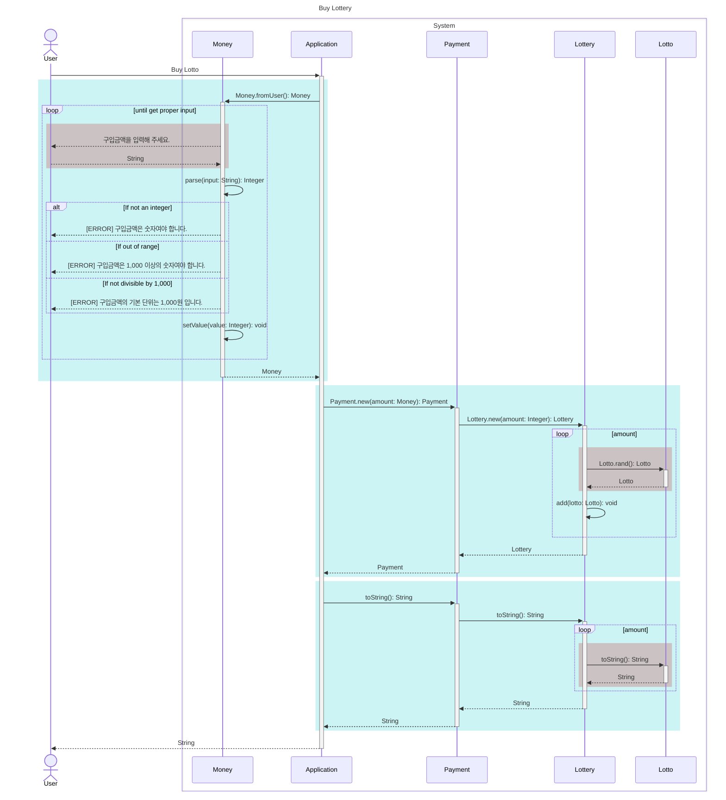
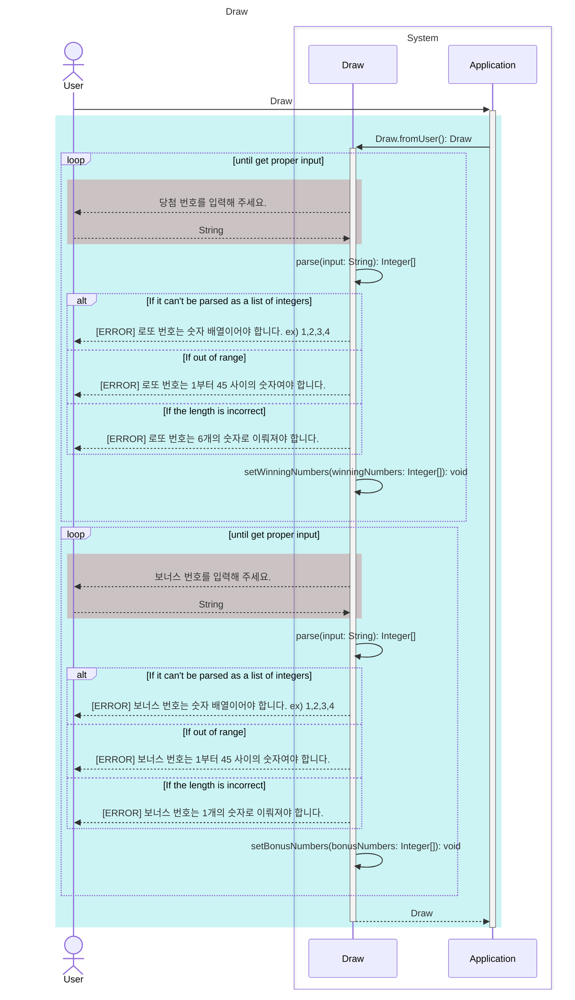
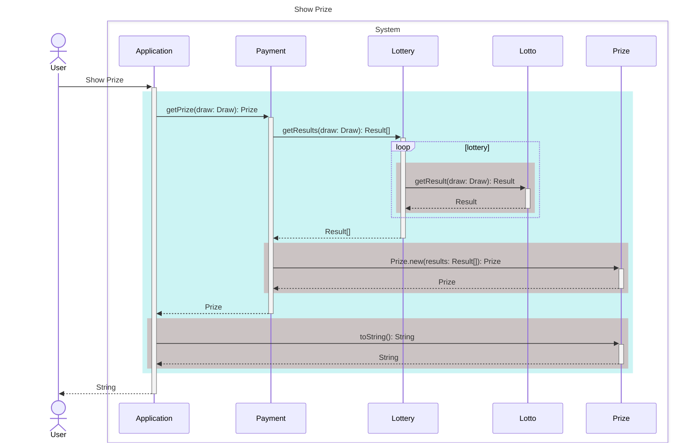
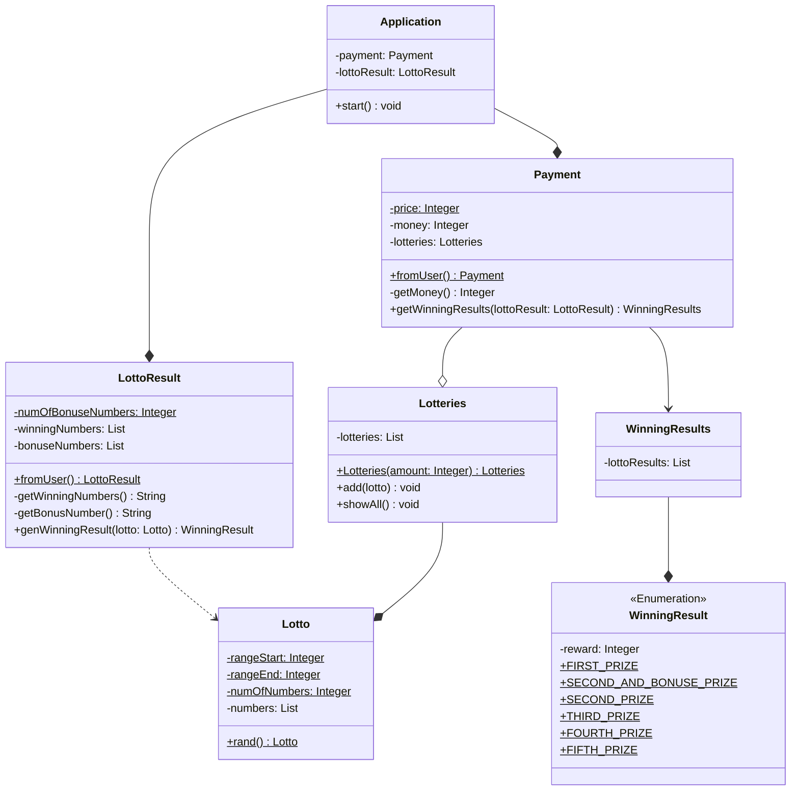

## OOA

### System Sequence

```mermaid
sequenceDiagram
    actor User
    participant System

    rect rgb(0, 200, 200, 0.2)
        User ->>+ System: buyLottery
        System -->> User: Money Request
        loop until get proper input
            rect rgb(200, 0, 000, 0.2)
                User -->> System: Money
            end
            opt wrong input
                System -->> User: Why user input is wrong
            end
        end

        System -->>- User: Payment Information
    end

    rect rgb(0, 200, 200, 0.2)
        User ->>+ System: draw
        System -->> User: WinningNumbers Request
        loop until get proper input
            rect rgb(200, 0, 000, 0.2)
                User -->> System: WinningNumbers
            end
            opt wrong input
                System -->> User: Why user input is wrong
            end
        end

        System -->> User: BonusNumber Request
        loop until get proper input
            rect rgb(200, 0, 000, 0.2)
                User -->> System: BonusNumber
            end
            opt wrong input
                System -->> User: Why user input is wrong
            end
            deactivate System
        end
    end

    rect rgb(0, 200, 200, 0.2)
        User ->>+ System: showPrize
        System -->>- User: Prize
    end
```

### Domain Model

```mermaid
classDiagram
    direction RL
    Payment -- Draw
    Payment --o Lottery
    Lottery --* Lotto
    Lotto --* Result
    Payment --* Prize

    class Money {
        -UNIT: Integer$
        -value: Integer
    }

    class Payment {
        -MIN_AMOUNT: Money$
        -amount: Money
    }

    class Lottery {
        -amount: Integer
    }

    class Lotto {
        -PRICE: Money$
        -NUM_LOWER: Integer$
        -NUM_UPPER: Integer$
        -LEN: Integer$
        -numbers: Integer[]
    }

    class Draw {
        -BONUS_LEN: Integer$
        -WINNING_LEN: Integer$
        -winningNumbers: Integer[]
        -bonuseNumbers: Integer[]
    }

    class Result {
        <<Enumeration>>
        +FIRST_PRIZE$
        +SECOND_AND_BONUSE_PRIZE$
        +SECOND_PRIZE$
        +THIRD_PRIZE$
        +FOURTH_PRIZE$
        +FIFTH_PRIZE$
        -reward: Integer
    }
```

## OOD

### Operations

```mermaid
---
title: Buy Lottery
---
sequenceDiagram
    actor User
    box System
        participant Money
        participant Application
        participant Payment
        participant Lottery
        participant Lotto
    end

    User ->>+ Application: Buy Lotto
    rect rgb(0, 200, 200, 0.2)
        Application ->>+ Money: Money.fromUser(): Money

        loop until get proper input
            rect rgb(200, 0, 0, 0.2)
                Money -->> User: 구입금액을 입력해 주세요.
                User -->> Money: String
            end
            Money ->> Money: parse(input: String): Integer
            alt If not an integer
                Money -->> User: [ERROR] 구입금액은 숫자여야 합니다.
            else If out of range
                Money -->> User: [ERROR] 구입금액은 1,000 이상의 숫자여야 합니다.
            else If not divisible by 1,000
                Money -->> User: [ERROR] 구입금액의 기본 단위는 1,000원 입니다.
            end
            Money ->> Money: setValue(value: Integer): void
        end

        Money -->>- Application: Money
    end

    rect rgb(0, 200, 200, 0.2)
        Application ->>+ Payment: Payment.new(amount: Money): Payment
        Payment ->>+ Lottery: Lottery.new(amount: Integer): Lottery

        loop amount
            rect rgb(200, 0, 000, 0.2)
                Lottery ->>+ Lotto: Lotto.rand(): Lotto
                Lotto -->>- Lottery: Lotto
            end
            Lottery ->> Lottery: add(lotto: Lotto): void
        end

        Lottery -->>- Payment: Lottery
        Payment -->>- Application: Payment
    end

    rect rgb(0, 200, 200, 0.2)
        Application ->>+ Payment: toString(): String
        Payment ->>+ Lottery: toString(): String
        loop amount
            rect rgb(200, 0, 000, 0.2)
                Lottery ->>+ Lotto: toString(): String
                Lotto -->>- Lottery: String
            end
        end
        Lottery -->>- Payment: String
        Payment -->>- Application: String
    end
    Application -->>- User: String
```

```mermaid
---
title: Draw
---
sequenceDiagram
    actor User
    box System
        participant Draw
        participant Application
    end

    User ->>+ Application: Draw
    rect rgb(0, 200, 200, 0.2)
        Application ->>+ Draw: Draw.fromUser(): Draw

        loop until get proper input
            rect rgb(200, 0, 0, 0.2)
                Draw -->> User: 당첨 번호를 입력해 주세요.
                User -->> Draw: String
            end
            Draw ->> Draw: parse(input: String): Integer[]

            alt If it can't be parsed as a list of integers
                Draw -->> User: [ERROR] 로또 번호는 숫자 배열이어야 합니다. ex) 1,2,3,4
            else If out of range
                Draw -->> User: [ERROR] 로또 번호는 1부터 45 사이의 숫자여야 합니다.
            else If the length is incorrect
                Draw -->> User: [ERROR] 로또 번호는 6개의 숫자로 이뤄져야 합니다.
            end
            Draw ->> Draw: setWinningNumbers(winningNumbers: Integer[]): void
        end

        loop until get proper input
            rect rgb(200, 0, 0, 0.2)
                Draw -->> User: 보너스 번호를 입력해 주세요.
                User -->> Draw: String
            end
            Draw ->> Draw: parse(input: String): Integer[]

            alt If it can't be parsed as a list of integers
                Draw -->> User: [ERROR] 보너스 번호는 숫자 배열이어야 합니다. ex) 1,2,3,4
            else If out of range
                Draw -->> User: [ERROR] 보너스 번호는 1부터 45 사이의 숫자여야 합니다.
            else If the length is incorrect
                Draw -->> User: [ERROR] 보너스 번호는 1개의 숫자로 이뤄져야 합니다.
            end
            Draw ->> Draw: setBonusNumbers(bonusNumbers: Integer[]): void
        end

        Draw -->>- Application: Draw
    end

    deactivate Application
```

```mermaid
---
title: Show Prize
---
sequenceDiagram
    actor User
    box System
        participant Application
        participant Payment
        participant Lottery
        participant Lotto
        participant Prize
    end

    User ->>+ Application: Show Prize
    rect rgb(0, 200, 200, 0.2)
        Application ->>+ Payment: getPrize(draw: Draw): Prize
        Payment ->>+ Lottery: getResults(draw: Draw): Result[]

        loop lottery
            rect rgb(200, 0, 0, 0.2)
                Lottery ->>+ Lotto: getResult(draw: Draw): Result
                Lotto -->>- Lottery: Result
            end
        end
        Lottery -->>- Payment: Result[]

        rect rgb(200, 0, 0, 0.2)
            Payment ->>+ Prize: Prize.new(results: Result[]): Prize
            Prize -->>- Payment: Prize
        end
        Payment -->>- Application: Prize

        rect rgb(200, 0, 0, 0.2)
            Application ->>+ Prize: toString(): String
            Prize -->>- Application: String
        end
    end
    Application -->>- User: String
```

### Design Model

```mermaid
classDiagram
    Application --* Payment
    Application --* LottoResult
    Payment --o Lotteries
    Payment --> WinningResults
    LottoResult ..> Lotto
    Lotteries --* Lotto
    WinningResults --* WinningResult

    class Application {
        -payment: Payment
        -lottoResult: LottoResult
        +start() void
    }

    class Payment {
        -price: Integer$
        -money: Integer
        -lotteries: Lotteries
        +fromUser() Payment$
        -getMoney() Integer
        +getWinningResults(lottoResult: LottoResult) WinningResults
    }

    class Lotto {
        -rangeStart: Integer$
        -rangeEnd: Integer$
        -numOfNumbers: Integer$
        -numbers: List<Integer>
        +rand() Lotto$
    }

    class Lotteries {
        -lotteries: List<Lotto>
        +Lotteries(amount: Integer) Lotteries$
        +add(lotto) void
        +showAll() void
    }

    class LottoResult {
        -numOfBonuseNumbers: Integer$
        -winningNumbers: List<Integer>
        -bonuseNumbers: List<Integer>
        +fromUser() LottoResult$
        -getWinningNumbers() String
        -getBonusNumber() String
        +genWinningResult(lotto: Lotto) WinningResult
    }

    class WinningResult {
        <<Enumeration>>
        -reward: Integer
        +FIRST_PRIZE$
        +SECOND_AND_BONUSE_PRIZE$
        +SECOND_PRIZE$
        +THIRD_PRIZE$
        +FOURTH_PRIZE$
        +FIFTH_PRIZE$
    }

    class WinningResults {
        -lottoResults: List<WinningResult>
    }
```
